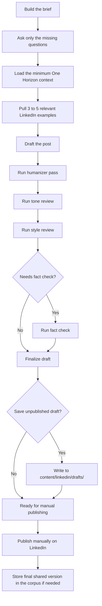
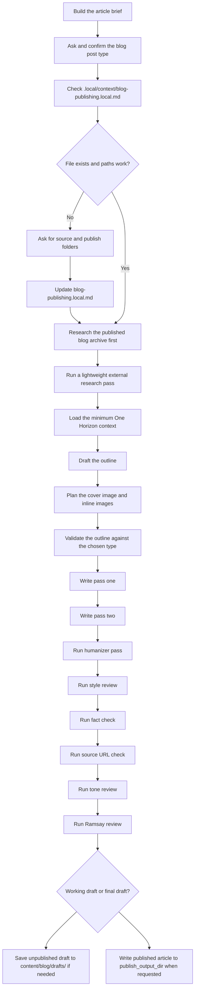

# Ink


A writing system for LinkedIn posts, Reddit discussions, and blog articles. Your drafts and corpus files stay on your machine. Your context and content pipeline live in One Horizon.

Ink is a [One Horizon](https://onehorizon.ai/?utm_source=github&utm_medium=ink&utm_content=readme) project for Claude Code, Cursor, and Codex. It reads your published archive and One Horizon context, runs a consistent workflow, and tracks your content pipeline without locking anything in the cloud.

Claude Code and Cursor are the smoothest path. Codex works too; it just needs one extra sync step to pick up the repo skills.

## What Ink does

- Surfaces content ideas from your archive, live signals, and One Horizon context — then logs each selected idea as a One Horizon approval record
- Drafts LinkedIn posts, comment replies, DMs, DM replies, and reposts
- Researches subreddits before drafting so the post fits the community
- Drafts Reddit posts and follow-up replies that read native to the thread
- Writes blog posts with internal research, staged review passes, and optional image sourcing
- Turns approved One Horizon ideas into reviewable draft initiatives for Blog, LinkedIn, and Reddit
- Creates concise locked briefs for new or updated website pages
- Runs humanizer, tone, style, fact-check, and URL review on every draft
- Logs approved posts to local corpora and records each published item as a One Horizon initiative
- Keeps drafts, secrets, and corpus files local and out of git

## Quick start

### 1. Clone the repo

```bash
git clone https://github.com/onehorizonai/ink ink
cd ink
```

### 2. Install `uv`

Ink uses `uv` to run local helpers and MCP servers.

On macOS:

```bash
brew install uv
```

On other platforms, use the [official uv installation guide](https://docs.astral.sh/uv/).

### 3. Open the cloned folder in your assistant

Open the repo root, not a subfolder. That gives the assistant access to the repo files and repo-local skills.

- Claude Code: start Claude Code from the `ink/` folder
- Cursor: open `ink/` as the project or workspace
- Codex: add `ink/` as a project

Ink commits repo-local MCP config for its local research and image tools. Install One Horizon separately in the assistant you use, then open the repo root so the assistant can see the repo-local skills, references, and local MCP config.

#### Codex only: run the sync step once for skills

```bash
./scripts/sync_repo_skills.sh codex
```

This step is for Codex only.

Codex does not automatically pick up repo-local skills from `.agents/`. This script links the repo's skill folders into your local Codex skills directory so Codex can see them.

Run it:

- once after cloning
- again after pulling changes that update repo skills
- any time Codex is missing the repo skills

Codex loads the skill list when a session starts. Running the sync script in an already-open thread does not reliably refresh that thread's available skills.

If the skills or local MCP tools still do not appear in Codex after syncing, start a new Codex thread or restart the Codex app or CLI and open the repo again.

### 4. Connect One Horizon

Ink stores your live author and company context in [One Horizon](https://onehorizon.ai/?utm_source=github&utm_medium=ink&utm_content=readme) so it is available across sessions and assistants.

Install the One Horizon MCP server in the assistant you use:

- [Claude Code setup](https://onehorizon.ai/docs/integrations/claude-code)
- [Cursor setup](https://onehorizon.ai/docs/integrations/cursor)
- [Codex setup](https://onehorizon.ai/docs/integrations/codex)

After setup, Ink workflows use the needed One Horizon tool call directly. If a One Horizon tool call is missing or fails, start a new session or restart the assistant and open the repo again.

### 5. Run setup once

In your assistant, run:

```text
Setup ink
```

This is the normal path. You do not need to create `.local/` folders by hand first.

It will:

- verify the One Horizon MCP connection
- ask for your website and LinkedIn profile
- pull in the public context it needs
- confirm any new author context docs before creating them
- create missing author-scoped context docs in One Horizon

### 6. Start writing

Good first prompts:

- `Find three content ideas I should write next`
- `Draft a LinkedIn post about...`
- `Research the best Reddit communities for...`
- `Draft a Reddit post about...`
- `Outline a blog post about...`
- `Create missing context docs from my website and LinkedIn`

# Usage guides

## Set up Ink once

Run `one-horizon-context-setup` once after cloning, then again any time your context changes.

Guided example:

```md
User:
Set up Ink

Agent:
I can do that. What is the primary company site?

User:
https://piedpiper.com

Agent:
What is the LinkedIn profile URL?

User:
https://www.linkedin.com/in/richard-hendricks

Agent:
I’ll resolve the author in One Horizon, use the standard setup, and skip personal-life for now. If author context docs already exist, I’ll leave them unchanged.

...
```

What happens:

- verifies the One Horizon MCP connection
- resolves the author through One Horizon
- checks for existing author-scoped One Horizon context docs
- asks for the minimum missing facts
- checks whether anything can be overwritten
- creates missing One Horizon author context docs and parent initiatives

## Find what to write next

Start with `content-idea-finder` when you want to choose the topic before you commit to a post or article. When it picks an idea, it logs that idea as a One Horizon approval record titled `[Ink Idea] [Channel] ...`.

Example prompt:

```text
Find five content ideas for me.
Give me three LinkedIn ideas and two blog ideas based on my current context, recent themes, and gaps in my existing content.
```

## Write a LinkedIn post

Use `linkedin-social-writer` when you are ready to draft.

Example prompt:

```text
Draft a LinkedIn post about why most AI workflow demos fall apart in production.
```

LinkedIn workflow:



How LinkedIn publishing works:

- Ink does not post to LinkedIn for you.
- Ink writes drafts and corpus entries locally.
- You review the final copy, then publish it yourself on LinkedIn.
- Use `linkedin-finalize-post` if the draft still needs a final pass before you save it.
- Use `linkedin-store-post` if you already published it and just want the exact text logged.

## Research Reddit communities

Start with `reddit-research` when the first question is where the topic belongs.

Example prompt:

```text
Find the best Reddit communities and recent winning post patterns for founders talking about AI workflow reliability.
```

## Write a Reddit post

Once you know the subreddit and angle, `reddit-social-writer` handles the draft.

Example prompt:

```text
Draft a Reddit post for r/startups about why early founder outreach should stay manual before automation.
```

How Reddit writing works:

- Ink does not post to Reddit for you.
- It checks subreddit fit, rules, and recent top posts before it starts writing.
- It writes posts and follow-up replies locally.
- Use `reddit-finalize-post` if the draft still needs a final review before you save it.
- Use `reddit-store-post` if it is already live and you just want the exact text logged.

## Write a blog post

Use `blog-post-writer` when you want a full article draft.

If you already know the shape you want, say it up front. If you do not, Ink will ask before it starts research or outlining.

Supported blog post types:

- `opinion / argument`
- `explainer`
- `comparison`
- `product / deep dive`
- `personal essay / rant`
- `journal / dispatch`
- `reflective / inspirational`
- `review`

Example prompts:

```text
Write a blog post about why agent workflows break between demo and deployment.
```

```text
Write an explainer blog post about why agent workflows break between demo and deployment.
```

```text
Write a comparison blog post about roadmap-first versus ticket-first AI workflows.
```

Blog workflow:



How blog writing works:

- Ink asks what kind of post this should be before it researches, outlines, or drafts.
- If you already imply a type, Ink reflects that guess back and asks you to confirm or correct it.
- If you say something broad like `article`, `story`, or `essay`, Ink maps that to a concrete post type and checks the mapping with you first.
- That confirmed type shapes the archive examples it pulls, the playbook it validates against, and how much personal context it loads.
- Ink reads `.local/context/blog-publishing.local.md` to find `source_articles_dir` and `publish_output_dir`.
- If that file is missing, unset, or points to a folder that no longer exists, Ink asks for the correct folders first.
- It uses `source_articles_dir` to read your published archive.
- It uses `publish_output_dir` to write finished articles.
- Unpublished working drafts still belong in `content/blog/drafts/`.
- If you use blog images, `blog-image-finder` handles search and download, and `blog-image-uploader` handles S3 upload.

## Create a website page brief

Use `page-brief-builder` when you need a proper brief for a new or updated website page before anyone starts writing copy or building.

In Codex, if a natural prompt does not route correctly, name the entry skill directly:

```text
Use page-brief-builder to create a brief to update our alternative to Linear page.
```

Typical prompts:

```text
Create a brief for a new product page about automated reporting.
```

```text
Write a landing page brief for our AI support offering.
```

```text
Update the brief for this existing help page: https://example.com/help/billing
```

```text
Use page-brief-builder to create a structured brief for a comparison page between our product and manual workflows.
```

It will:

- ask for missing context before it starts guessing
- look at relevant pages on your site
- check competitor or comparable pages
- brainstorm up to 3 viable page directions
- recommend one direction or pause and ask you to choose when multiple directions stay viable
- work through SEO, positioning, proof, objections, and CTA logic
- use [copywriting](.agents/copywriting/SKILL.md) to lock exact H1, metadata, section headings, supporting-content modules, and CTA labels inside the brief
- validate claims when needed
- return one concise locked implementation brief with exact page changes, required links, and CTA labels

It will not:

- write final marketing copy
- output HTML, CSS, JS, React, or components
- turn the brief into implementation code
- return a loose research summary disguised as a brief

## When to use [copywriting](.agents/copywriting/SKILL.md)

Use [copywriting](.agents/copywriting/SKILL.md) when you want actual page copy drafted, rewritten, or tightened.

If routing is ambiguous, name it directly:

```text
Use copywriting to write homepage copy for our analytics product.
```

It should also trigger from plain requests like:

- `Write copy for this landing page`
- `Rewrite this feature page`
- `Improve this page copy`
- `Give me headline help`
- `Give me CTA copy for this pricing page`

In this repo, the split is simple:

- `page-brief-builder` for the strategy and brief
- `page-brief-copy-playbook` for copy guidance inside that brief
- [copywriting](.agents/copywriting/SKILL.md) for the final page copy once the brief is clear

If you want both, just say so:

```text
Use page-brief-builder to create the brief first.
After that, use copywriting to draft the page copy.
```

## Review a draft without starting over

If the draft already exists and you only want one kind of pass, call the review skill directly.

- `content-humanizer`: remove AI tells early
- `content-tone-review`: check voice, stance, and personal-detail level
- `content-style-review`: tighten flow, readability, and persuasion
- `fact-check`: verify dates, names, numbers, product facts, and other unstable claims
- `source-url-check`: verify URLs in blog articles
- `blog-post-ramsay-review`: get a blunt late-stage review of a blog draft

## Store published content in the corpus

Use these skills when the writing already exists and you want it saved in the corpus. Each skill also creates a One Horizon child initiative under the matching channel parent (`Ink - LinkedIn` or `Ink - Reddit`) so your published work is tracked in one place.

- `linkedin-finalize-post`: final pass, then optional storage when approval is explicit
- `linkedin-store-post`: store content that was already shared or published
- `reddit-finalize-post`: final pass, then optional storage when approval is explicit
- `reddit-store-post`: store Reddit content that was already shared or published

## Run the One Horizon content pipeline

Use these skills when a local automation or manual prompt should move content through One Horizon. This repo defines the workflows; automation scheduling is configured outside the repo.

- `content-creation-runner`: finds planned `[Ink Idea]` records, drafts the right Blog, LinkedIn, or Reddit content, and creates `[Ink Draft]` child initiatives in `In Review`.
- `content-publishing-runner`: finds `[Ink Draft]` initiatives in `Planned` or `In Progress`, applies new comments, returns revisions to `In Review`, or prepares publish-ready output.

In this pipeline, One Horizon is the review source of truth. Social drafts are stored in draft initiative descriptions, not local draft files. Blog publishing writes to the configured `publish_output_dir` and opens a pull request.

When a workflow finds an existing Ink initiative outside the matching channel parent, it should move it under `Ink - Blog`, `Ink - LinkedIn`, or `Ink - Reddit` before continuing.

## Skill guide

### Core workflows

| Skill | Use it for |
| --- | --- |
| `one-horizon-context-setup` | Create missing One Horizon author context docs |
| `content-idea-finder` | Decide what to write next |
| `content-creation-runner` | Turn approved Ink ideas into review draft initiatives |
| `content-publishing-runner` | Revise draft initiatives or prepare publish-ready output |
| `linkedin-social-writer` | Draft LinkedIn posts, replies, DMs, and reposts |
| `linkedin-finalize-post` | Final-pass a LinkedIn draft and store it when approved |
| `linkedin-store-post` | Store LinkedIn posts that already exist |
| `reddit-research` | Find the right subreddits, rules, and recent winning post patterns |
| `reddit-social-writer` | Draft Reddit posts and follow-up comment replies |
| `reddit-finalize-post` | Final-pass a Reddit draft and store it when approved |
| `reddit-store-post` | Store Reddit posts or replies that already exist |
| `blog-post-writer` | Write full blog drafts from brief to article |
| `page-brief-builder` | Create a concise locked brief for a new or updated website page |
| `copywriting` | Write, rewrite, or improve final marketing copy for website pages |

### Website page brief suite

| Skill | Use it for |
| --- | --- |
| `website-brief-intake` | Capture required inputs and missing context |
| `website-pattern-analyzer` | Inspect same-site page patterns and update-page changes |
| `competitor-page-research` | Research competitor or comparable pages |
| `page-seo-intent-planner` | Plan search intent, exact metadata, links, and overlap risk |
| `page-positioning-strategist` | Define value proposition, proof, objections, and claims ledger |
| `conversion-cta-planner` | Plan CTA logic, friction handling, and conversion support |
| `page-brief-assembler` | Assemble the final locked brief |
| `page-brief-page-playbook` | Apply local page-type defaults when site evidence is thin |
| `page-brief-seo-playbook` | Apply local SEO and internal-linking rules to the brief |
| `page-brief-copy-playbook` | Apply local hero, proof, CTA, and exact copy-atom rules to the brief |

### Review and quality passes

| Skill | Use it for |
| --- | --- |
| `content-humanizer` | Remove AI-sounding copy early |
| `content-tone-review` | Check whether the draft sounds like the author |
| `content-style-review` | Tighten structure, readability, and persuasion |
| `fact-check` | Verify unstable or external claims |
| `source-url-check` | Check blog source URLs before publishing |
| `blog-post-ramsay-review` | Pressure-test a blog draft late in the process |

### Optional image workflow

| Skill | Use it for |
| --- | --- |
| `blog-image-finder` | Search Unsplash and download candidate blog images |
| `blog-image-uploader` | Upload approved blog images to your configured S3 bucket |

## What stays local

The repo keeps the workflow. Your real context, drafts, and secrets stay on your machine.

Keep these local and uncommitted:

- `.local/context/blog-publishing.local.md` for machine-local blog path state
- `.secrets/` for API keys and local config
- `content/linkedin/` for your real LinkedIn corpus
- `content/linkedin/drafts/` for unpublished LinkedIn drafts created by direct writer workflows
- `content/reddit/` for your real Reddit corpus
- `content/reddit/drafts/` for unpublished Reddit drafts created by direct writer workflows
- `content/blog/drafts/` for unpublished blog drafts
- any published blog source folder referenced by `.local/context/blog-publishing.local.md`

## Advanced setup

Skip this section unless you want MCP research or the blog image flow.

### MCP setup

Ink ships repo-local MCP registration for local stdio servers only:

- `.mcp.json` for assistants that read workspace MCP config
- `.codex/config.toml` for Codex project-local MCP config

Required for live context and write-back:

- One Horizon MCP: follow the official setup for [Claude Code](https://onehorizon.ai/docs/integrations/claude-code), [Cursor](https://onehorizon.ai/docs/integrations/cursor), or [Codex](https://onehorizon.ai/docs/integrations/codex). Do not add One Horizon to repo-local MCP config.

Repo-local tools used by some writing workflows:

- `linkedin-social-research`: `uv run ./.agents/linkedin-social-writer/mcp/social-research/server.py`
- `blog-image-finder`: `uv run ./.agents/blog-image-finder/mcp/image-provider/server.py`
- `blog-image-uploader`: `uv run ./.agents/blog-image-uploader/mcp/blog-image-s3/server.py`

If you want to verify the local MCP setup:

```bash
uv run .agents/mcp/verify_servers.py
```

This script verifies the repo-local stdio servers only. It does not verify One Horizon, because One Horizon is configured in your assistant or user-level tooling.

### Unsplash setup for `blog-image-finder`

You need an Unsplash developer app before image search will work.

1. Create or sign in to your Unsplash account.
2. Open [your Unsplash apps](https://unsplash.com/oauth/applications) and create a new application.
3. Copy the app's `Access Key`.
4. Save that key in `.secrets/image-provider.json` as `access_key`.

New Unsplash apps start in demo mode, which is enough for setup and testing. If you end up using this in a real workflow, apply for production access from the Unsplash dashboard after the integration works.

Create `.secrets/image-provider.json`:

```json
{
  "provider": "unsplash",
  "access_key": "YOUR_UNSPLASH_ACCESS_KEY",
  "download_dir": "./.secrets/downloads/blog-images",
  "history_path": "./.secrets/image-download-history.json",
  "timeout_seconds": 30
}
```

Keep the key local. Do not commit it. If you plan to ship an Unsplash-backed workflow publicly, read the [Unsplash API documentation](https://unsplash.com/documentation) and the [API guidelines](https://help.unsplash.com/en/articles/2511245-unsplash-api-guidelines), especially the parts about attribution and download tracking.

### S3 setup for `blog-image-uploader`

Create `.secrets/blog-image-s3.json`:

```json
{
  "bucket": "your-blog-images",
  "region": "your-region",
  "access_key_id": "YOUR_ACCESS_KEY_ID",
  "secret_access_key": "YOUR_SECRET_ACCESS_KEY",
  "session_token": "",
  "endpoint_url": "https://your-s3-endpoint.example.com",
  "public_base_url": "https://cdn.example.com/your-blog-images",
  "key_prefix": "images/posts",
  "history_path": "./.secrets/blog-image-upload-history.json",
  "addressing_style": "path",
  "timeout_seconds": 30
}
```

Use `addressing_style: "path"` for path-style S3 endpoints. Use `virtual` for bucket-subdomain hosts with matching TLS support.

### Manual blog path setup

Only use this if you want to set the blog path without running `Setup ink`.

Create `.local/context/blog-publishing.local.md` with the required fields:

```md
# Blog Publishing Local Config

This file stores machine-local blog path values for this workspace.

## Active Paths

- `source_articles_dir`: `/absolute/path/to/published/articles`
- `publish_output_dir`: `/absolute/path/to/published/articles`
- `last_confirmed_on`: `YYYY-MM-DD`
```

## Troubleshooting

- Codex does not show the repo skills:
  Run `./scripts/sync_repo_skills.sh codex`, then restart the Codex app or CLI and open the repo again.
- One Horizon MCP tools are missing in Codex:
  Follow the official [Codex setup](https://onehorizon.ai/docs/integrations/codex), authenticate One Horizon, then start a fresh thread from the repo root.
- One Horizon MCP tools are missing in Claude Code or Cursor:
  Follow the official [Claude Code setup](https://onehorizon.ai/docs/integrations/claude-code) or [Cursor setup](https://onehorizon.ai/docs/integrations/cursor), authenticate One Horizon, then start a fresh session from the repo root.
- Other MCP tools are missing:
  Make sure you opened the repo root so the assistant can see `.mcp.json` or `.codex/config.toml`. Start a new session if the server does not appear.
- Writing feels generic:
  Run `Setup ink` again or ask Ink to refresh your context from your website and LinkedIn.
- Unsplash image search does not work:
  Confirm you created an Unsplash app and saved the `Access Key` in `.secrets/image-provider.json`.

## Repo layout

- [.agents](.agents): the repo skills, references, templates, and MCP helpers
- [.local](.local/README.md): local setup contract, starter templates, and ignored runtime context
- [content/linkedin](content/linkedin/README.md): local LinkedIn corpus workspace
- [content/reddit](content/reddit/README.md): local Reddit corpus workspace
- [content/blog](content/blog/README.md): local blog workspace
- [scripts](scripts): repo helper scripts

## License

This repo is released under [Apache-2.0](LICENSE).

## Contributing

Contributions are welcome, especially for setup fixes, doc fixes, new skills, and integration support.

If you want to contribute:

1. Open an issue first for larger changes, new workflows, or new integrations.
2. Keep each pull request focused on one clear change.
3. Explain the user-facing impact, not just the implementation details.
4. Update the README or skill docs when setup or behavior changes.
5. Never commit `.local/`, `.secrets/`, private corpora, or other local-only content.

The repo also includes:

- a pull request template for describing the change, review path, and checks
- a bug report template for setup, workflow, MCP, and skill issues
- a feature request template for new workflows and improvements
