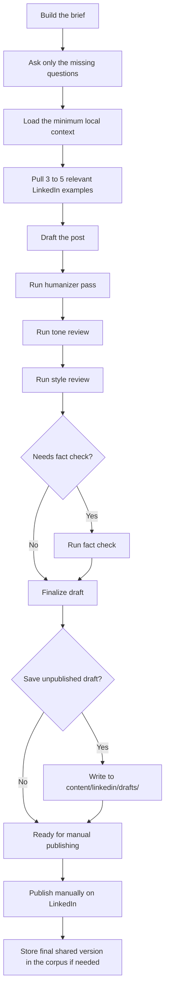
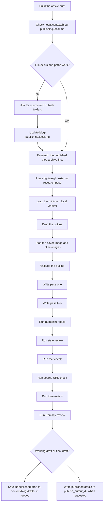

# Ink


A local writing system for LinkedIn posts, Reddit discussions, and blog articles. Your drafts, context, and working files stay on your machine.

Ink is a [One Horizon](https://onehorizon.ai/?utm_source=github&utm_medium=ink&utm_content=readme) project for Claude Code, Cursor, and Codex. It uses your local context, looks at the content you already wrote, runs a consistent workflow, and leaves the files local.

Claude Code and Cursor are the smoothest path. Codex works too; it just needs one extra sync step so it can see the repo-local skills.

## What Ink does

- Finds content ideas from your context, published content, and recent research
- Drafts LinkedIn posts, comment replies, DMs, DM replies, and reposts
- Checks which subreddits fit the topic before it starts drafting
- Drafts Reddit posts and follow-up replies that sound like they belong there
- Writes blog posts with research, review passes, and optional image support
- Creates strategic implementation briefs for new or updated website pages
- Reviews drafts for tone, structure, facts, URLs, and obvious AI tells
- Logs approved LinkedIn and Reddit posts back into local corpora
- Keeps live context, secrets, and real content out of git

## Quick start

### 1. Clone the repo

```bash
git clone https://github.com/onehorizonai/ink ink
cd ink
```

### 2. Install `uv`

Ink uses `uv` to run local helpers and MCP servers.

On macOS:

```bash
brew install uv
```

On other platforms, use the [official uv installation guide](https://docs.astral.sh/uv/).

### 3. Open the cloned folder in your assistant

Open the repo root, not a subfolder. That gives the assistant access to the repo files and the local MCP config.

- Claude Code: start Claude Code from the `ink/` folder
- Cursor: open `ink/` as the project or workspace
- Codex: add `ink/` as a project

Claude Code and Cursor read the workspace [.mcp.json](.mcp.json). Codex uses the repo-scoped [.codex/config.toml](.codex/config.toml).

#### Codex only: run the sync step once for skills

```bash
./scripts/sync_repo_skills.sh codex
```

This step is for Codex only.

Codex does not automatically pick up repo-local skills from `.agents/`. This script links the repo's skill folders into your local Codex skills directory so Codex can see them.

The repo-scoped [.codex/config.toml](.codex/config.toml) already exposes the local MCP servers for this project. You should not need to add them by hand unless you want a different setup.

Run it:

- once after cloning
- again after pulling changes that update repo skills
- any time Codex is missing the repo skills

Codex loads the skill list when a session starts. Running the sync script in an already-open thread does not reliably refresh that thread's available skills.

If the skills or local MCP tools still do not appear in Codex after syncing, start a new Codex thread or restart the Codex app or CLI and open the repo again.

### 4. Run setup once

In your assistant, run:

```text
Setup ink
```

This is the normal path. You do not need to create `.local/` folders by hand first.

It will:

- ask for your website and LinkedIn profile
- pull in the public context it needs
- confirm anything that might overwrite existing local context
- create or update the local context files under `.local/context/`

### 5. Start writing

Good first prompts:

- `Find three content ideas I should write next`
- `Draft a LinkedIn post about...`
- `Research the best Reddit communities for...`
- `Draft a Reddit post about...`
- `Outline a blog post about...`
- `Refresh my local context from my website and LinkedIn`

# Usage guides

## Set up Ink once

Run `local-context-setup` once after cloning, then again any time your local context changes.

Guided example:

```md
User:
Set up Ink

Agent:
I can do that. What is the primary company site?

User:
https://piedpiper.com

Agent:
What is the LinkedIn profile URL?

User:
https://www.linkedin.com/in/richard-hendricks

Agent:
I’ll use the standard setup and skip personal-life for now. If I find existing local context, I’ll stop and ask before changing it.

...
```

What happens:

- reads the local setup contract
- asks for the minimum missing facts
- checks whether anything can be overwritten
- creates or updates `.local/context/`

## Find what to write next

Start with `content-idea-finder` when you want to choose the topic before you commit to a post or article.

Example prompt:

```text
Find five content ideas for me.
Give me three LinkedIn ideas and two blog ideas based on my current context, recent themes, and gaps in my existing content.
```

## Write a LinkedIn post

Use `linkedin-social-writer` when you are ready to draft.

Example prompt:

```text
Draft a LinkedIn post about why most AI workflow demos fall apart in production.
```

LinkedIn workflow:



How LinkedIn publishing works:

- Ink does not post to LinkedIn for you.
- Ink writes drafts and corpus entries locally.
- You review the final copy, then publish it yourself on LinkedIn.
- Use `linkedin-finalize-post` if the draft still needs a final pass before you save it.
- Use `linkedin-store-post` if you already published it and just want the exact text logged.

## Research Reddit communities

Start with `reddit-research` when the first question is where the topic belongs.

Example prompt:

```text
Find the best Reddit communities and recent winning post patterns for founders talking about AI workflow reliability.
```

## Write a Reddit post

Once you know the subreddit and angle, `reddit-social-writer` handles the draft.

Example prompt:

```text
Draft a Reddit post for r/startups about why early founder outreach should stay manual before automation.
```

How Reddit writing works:

- Ink does not post to Reddit for you.
- It checks subreddit fit, rules, and recent top posts before it starts writing.
- It writes posts and follow-up replies locally.
- Use `reddit-finalize-post` if the draft still needs a final review before you save it.
- Use `reddit-store-post` if it is already live and you just want the exact text logged.

## Write a blog post

Use `blog-post-writer` when you want a full article draft.

Example prompt:

```text
Write a blog post about why agent workflows break between demo and deployment.
```

Blog workflow:



How blog publishing works:

- Ink reads `.local/context/blog-publishing.local.md` to find `source_articles_dir` and `publish_output_dir`.
- If that file is missing, unset, or points to a folder that no longer exists, Ink asks for the correct folders first.
- It uses `source_articles_dir` to read your published archive.
- It uses `publish_output_dir` to write finished articles.
- Unpublished working drafts still belong in `content/blog/drafts/`.
- If you use blog images, `blog-image-finder` handles search and download, and `blog-image-uploader` handles S3 upload.

## Create a website page brief

Use `page-brief-builder` when you need a proper brief for a new or updated website page before anyone starts writing copy or building.

In Codex, if a natural prompt does not route correctly, name the entry skill directly:

```text
Use page-brief-builder to create a brief to update our alternative to Linear page.
```

Typical prompts:

```text
Create a brief for a new product page about automated reporting.
```

```text
Write a landing page brief for our AI support offering.
```

```text
Update the brief for this existing help page: https://example.com/help/billing
```

```text
Use page-brief-builder to create a structured brief for a comparison page between our product and manual workflows.
```

It will:

- ask for missing context before it starts guessing
- look at relevant pages on your site
- check competitor or comparable pages
- brainstorm up to 3 viable page directions
- recommend one direction or pause and ask you to choose when multiple directions stay viable
- work through SEO, positioning, proof, objections, and CTA logic
- use [copywriting](.agents/copywriting/SKILL.md) to lock exact H1, metadata, section headings, supporting-content modules, and CTA labels inside the brief
- validate claims when needed
- return one concise locked implementation brief with exact page changes, required links, and CTA labels

It will not:

- write final marketing copy
- output HTML, CSS, JS, React, or components
- turn the brief into implementation code
- return a loose research summary disguised as a brief

## When to use [copywriting](.agents/copywriting/SKILL.md)

Use [copywriting](.agents/copywriting/SKILL.md) when you want actual page copy drafted, rewritten, or tightened.

If routing is ambiguous, name it directly:

```text
Use copywriting to write homepage copy for our analytics product.
```

It should also trigger from plain requests like:

- `Write copy for this landing page`
- `Rewrite this feature page`
- `Improve this page copy`
- `Give me headline help`
- `Give me CTA copy for this pricing page`

In this repo, the split is simple:

- `page-brief-builder` for the strategy and brief
- `page-brief-copy-playbook` for copy guidance inside that brief
- [copywriting](.agents/copywriting/SKILL.md) for the final page copy once the brief is clear

If you want both, just say so:

```text
Use page-brief-builder to create the brief first.
After that, use copywriting to draft the page copy.
```

## Review a draft without starting over

If the draft already exists and you only want one kind of pass, call the review skill directly.

- `content-humanizer`: remove AI tells early
- `content-tone-review`: check voice, stance, and personal-detail level
- `content-style-review`: tighten flow, readability, and persuasion
- `fact-check`: verify dates, names, numbers, product facts, and other unstable claims
- `source-url-check`: verify URLs in blog articles
- `blog-post-ramsay-review`: get a blunt late-stage review of a blog draft

## Store published content in the corpus

Use these skills when the writing already exists and you want it saved in the corpus.

- `linkedin-finalize-post`: final pass, then optional storage when approval is explicit
- `linkedin-store-post`: store content that was already shared or published
- `reddit-finalize-post`: final pass, then optional storage when approval is explicit
- `reddit-store-post`: store Reddit content that was already shared or published

## Skill guide

### Core workflows

| Skill | Use it for |
| --- | --- |
| `local-context-setup` | Set up or refresh `.local/context/` |
| `content-idea-finder` | Decide what to write next |
| `linkedin-social-writer` | Draft LinkedIn posts, replies, DMs, and reposts |
| `linkedin-finalize-post` | Final-pass a LinkedIn draft and store it when approved |
| `linkedin-store-post` | Store LinkedIn posts that already exist |
| `reddit-research` | Find the right subreddits, rules, and recent winning post patterns |
| `reddit-social-writer` | Draft Reddit posts and follow-up comment replies |
| `reddit-finalize-post` | Final-pass a Reddit draft and store it when approved |
| `reddit-store-post` | Store Reddit posts or replies that already exist |
| `blog-post-writer` | Write full blog drafts from brief to article |
| `page-brief-builder` | Create a concise locked brief for a new or updated website page |
| `copywriting` | Write, rewrite, or improve final marketing copy for website pages |

### Website page brief suite

| Skill | Use it for |
| --- | --- |
| `website-brief-intake` | Capture required inputs and missing context |
| `website-pattern-analyzer` | Inspect same-site page patterns and update-page changes |
| `competitor-page-research` | Research competitor or comparable pages |
| `page-seo-intent-planner` | Plan search intent, exact metadata, links, and overlap risk |
| `page-positioning-strategist` | Define value proposition, proof, objections, and claims ledger |
| `conversion-cta-planner` | Plan CTA logic, friction handling, and conversion support |
| `page-brief-assembler` | Assemble the final locked brief |
| `page-brief-page-playbook` | Apply local page-type defaults when site evidence is thin |
| `page-brief-seo-playbook` | Apply local SEO and internal-linking rules to the brief |
| `page-brief-copy-playbook` | Apply local hero, proof, CTA, and exact copy-atom rules to the brief |

### Review and quality passes

| Skill | Use it for |
| --- | --- |
| `content-humanizer` | Remove AI-sounding copy early |
| `content-tone-review` | Check whether the draft sounds like the author |
| `content-style-review` | Tighten structure, readability, and persuasion |
| `fact-check` | Verify unstable or external claims |
| `source-url-check` | Check blog source URLs before publishing |
| `blog-post-ramsay-review` | Pressure-test a blog draft late in the process |

### Optional image workflow

| Skill | Use it for |
| --- | --- |
| `blog-image-finder` | Search Unsplash and download candidate blog images |
| `blog-image-uploader` | Upload approved blog images to your configured S3 bucket |

## What stays local

The repo keeps the workflow. Your real context, drafts, and secrets stay on your machine.

Keep these local and uncommitted:

- `.local/context/` for live identity, company, and writing context
- `.secrets/` for API keys and local config
- `content/linkedin/` for your real LinkedIn corpus
- `content/linkedin/drafts/` for unpublished LinkedIn drafts
- `content/reddit/` for your real Reddit corpus
- `content/reddit/drafts/` for unpublished Reddit drafts
- `content/blog/drafts/` for unpublished blog drafts
- any published blog source folder referenced by `.local/context/blog-publishing.local.md`

## Advanced setup

Skip this section unless you want MCP research or the blog image flow.

### MCP setup

The repo includes a workspace-local [.mcp.json](.mcp.json) with three local MCP servers:

- `linkedin-social-research` for LinkedIn and Reddit research during writing
- `blog-image-finder` for Unsplash-backed image search and download
- `blog-image-uploader` for S3-backed image upload

If your assistant supports workspace MCP config, opening the repo root is usually enough to pick them up.

If you want to verify the MCP setup:

```bash
uv run .agents/mcp/verify_servers.py
```

If `uv` cache permissions get in the way:

```bash
UV_CACHE_DIR=/tmp/uv-cache uv run .agents/mcp/verify_servers.py
```

### Unsplash setup for `blog-image-finder`

You need an Unsplash developer app before image search will work.

1. Create or sign in to your Unsplash account.
2. Open [your Unsplash apps](https://unsplash.com/oauth/applications) and create a new application.
3. Copy the app's `Access Key`.
4. Save that key in `.secrets/image-provider.json` as `access_key`.

New Unsplash apps start in demo mode, which is enough for setup and testing. If you end up using this in a real workflow, apply for production access from the Unsplash dashboard after the integration works.

Create `.secrets/image-provider.json`:

```json
{
  "provider": "unsplash",
  "access_key": "YOUR_UNSPLASH_ACCESS_KEY",
  "download_dir": "./.secrets/downloads/blog-images",
  "history_path": "./.secrets/image-download-history.json",
  "timeout_seconds": 30
}
```

Keep the key local. Do not commit it. If you plan to ship an Unsplash-backed workflow publicly, read the [Unsplash API documentation](https://unsplash.com/documentation) and the [API guidelines](https://help.unsplash.com/en/articles/2511245-unsplash-api-guidelines), especially the parts about attribution and download tracking.

### S3 setup for `blog-image-uploader`

Create `.secrets/blog-image-s3.json`:

```json
{
  "bucket": "your-blog-images",
  "region": "your-region",
  "access_key_id": "YOUR_ACCESS_KEY_ID",
  "secret_access_key": "YOUR_SECRET_ACCESS_KEY",
  "session_token": "",
  "endpoint_url": "https://your-s3-endpoint.example.com",
  "public_base_url": "https://cdn.example.com/your-blog-images",
  "key_prefix": "images/posts",
  "history_path": "./.secrets/blog-image-upload-history.json",
  "addressing_style": "path",
  "timeout_seconds": 30
}
```

Use `addressing_style: "path"` for path-style S3 endpoints. Use `virtual` for bucket-subdomain hosts with matching TLS support.

### Manual local setup

Only use this if you do not want to run `Setup ink`.

Start with [.local/README.md](.local/README.md), then copy the templates into `.local/context/`:

```bash
mkdir -p .local/context

for src in .local/templates/*.template.md; do
  name="$(basename "$src" .template.md)"
  cp "$src" ".local/context/$name.md"
done
```

## Troubleshooting

- Codex does not show the repo skills:
  Run `./scripts/sync_repo_skills.sh codex`, then restart the Codex app or CLI and open the repo again.
- MCP tools are missing:
  Make sure you opened the repo root so the assistant can see `.mcp.json`.
- Writing feels generic:
  Run `Setup ink` again or ask Ink to refresh your local context.
- Unsplash image search does not work:
  Confirm you created an Unsplash app and saved the `Access Key` in `.secrets/image-provider.json`.

## Repo layout

- [.agents](.agents): the repo skills, references, templates, and MCP helpers
- [.local](.local/README.md): local setup contract, starter templates, and ignored runtime context
- [content/linkedin](content/linkedin/README.md): local LinkedIn corpus workspace
- [content/reddit](content/reddit/README.md): local Reddit corpus workspace
- [content/blog](content/blog/README.md): local blog workspace
- [scripts](scripts): repo helper scripts

## License

This repo is released under [Apache-2.0](LICENSE).

## Contributing

Contributions are welcome, especially for setup fixes, doc fixes, new skills, and integration support.

If you want to contribute:

1. Open an issue first for larger changes, new workflows, or new integrations.
2. Keep each pull request focused on one clear change.
3. Explain the user-facing impact, not just the implementation details.
4. Update the README or skill docs when setup or behavior changes.
5. Never commit `.local/`, `.secrets/`, private corpora, or other local-only content.

The repo also includes:

- a pull request template for describing the change, review path, and checks
- a bug report template for setup, workflow, MCP, and skill issues
- a feature request template for new workflows and improvements
