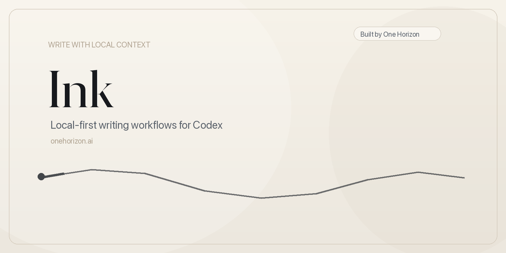

# Ink



Local-first writing workflows for Codex.

Ink helps you draft LinkedIn posts and blog articles in Codex without checking your real context, drafts, or secrets into git.

Built by [One Horizon](https://onehorizon.ai).

## Installation

Getting Ink running is quick.

### 1. Clone the repo

```bash
git clone https://github.com/onehorizonai/ink ink
cd ink
```

### 2. Install `uv`

Ink uses `uv` to run helper scripts and local MCP servers.

On macOS:

```bash
brew install uv
```

On other platforms, use the [official uv installation guide](https://docs.astral.sh/uv/).

### 3. Sync the repo skills before you start

```bash
./scripts/sync_repo_skills.sh codex
```

Run this before your first Codex session in the repo.

It links the skills in `.agents/` into your Codex skill directory so they are available in this workspace.

That includes:

- `Setup ink`
- the LinkedIn writer
- the blog writer
- the local review and helper skills shipped with the repo

If you skip this step, Codex will still open the repo, but the repo's own skills may be missing.

If you pull new repo changes later, or if the repo skills are updated, run the same command again to refresh the links.

### 4. Open the repo in Codex

Open the repo as the workspace root so Codex can pick up the local [.mcp.json](.mcp.json) configuration.

Start a fresh Codex session after syncing skills so the new skill list is available immediately.

## Getting Started

### 1. Create your local folders

```bash
mkdir -p .local/context .secrets
```

### 2. Set up your local context

The easiest way to do this is to let Ink guide you.

In Codex, run:

```text
Setup ink
```

The setup workflow will:

- ask for the public URLs you want to use
- prefer your company site as the main source when you have one
- ask for your LinkedIn profile URL
- check whether any existing local context can be overwritten
- confirm everything before it writes a file

### 3. Or set up the context manually

If you want to do it yourself, start with [.local/README.md](.local/README.md), then copy the starter templates:

```bash
for src in .local/templates/*.template.md; do
  name="$(basename "$src" .template.md)"
  cp "$src" ".local/context/$name.md"
done
```

Then fill in the copied files with your own context.

Most setups start with:

- `.local/context/profile.md`
- `.local/context/current-work.md`
- `.local/context/market-context.md`
- `.local/context/work-history.md`

You can add `personal-interests.md` and `personal-life.md` when you want more voice and personal context in the writing workflow.

### 4. Start writing

Once your local context is in place, you can start writing.

Good first prompts:

- `Use the LinkedIn writer to draft a post about...`
- `Use the blog writer to outline an article about...`
- `Refresh my local context from my website and LinkedIn`

## What Stays Local

The workflow lives in git. Your working data does not.

Keep these local and uncommitted:

- `.local/context/` for live author, company, and writing context
- `.secrets/` for API keys and local config files
- `content/linkedin/` for your real LinkedIn corpus
- `content/linkedin/drafts/` for unpublished LinkedIn drafts
- `content/blog/drafts/` for unpublished blog drafts

The repo tracks templates, workflow instructions, helper scripts, and keep files. Your real working data stays on your machine.

## Optional MCP Helpers

Ink includes a workspace-local `.mcp.json` with optional helpers for research and blog images:

- `linkedin-social-research`
- `blog-image-finder`
- `blog-image-uploader`

Use the research server for writing workflows. Use the image servers only if you want image sourcing and S3 upload support for blog posts.

To verify the MCP wiring:

```bash
uv run .agents/mcp/verify_servers.py
```

If `uv` cache permissions get in the way:

```bash
UV_CACHE_DIR=/tmp/uv-cache uv run .agents/mcp/verify_servers.py
```

## Optional Secret Config

### Unsplash image search

Create `.secrets/image-provider.json`:

```json
{
  "provider": "unsplash",
  "access_key": "YOUR_UNSPLASH_ACCESS_KEY",
  "download_dir": "./.secrets/downloads/blog-images",
  "history_path": "./.secrets/image-download-history.json",
  "timeout_seconds": 30
}
```

### S3-compatible blog image uploads

Create `.secrets/blog-image-s3.json`:

```json
{
  "bucket": "your-blog-images",
  "region": "your-region",
  "access_key_id": "YOUR_ACCESS_KEY_ID",
  "secret_access_key": "YOUR_SECRET_ACCESS_KEY",
  "session_token": "",
  "endpoint_url": "https://your-s3-endpoint.example.com",
  "public_base_url": "https://cdn.example.com/your-blog-images",
  "key_prefix": "images/posts",
  "history_path": "./.secrets/blog-image-upload-history.json",
  "addressing_style": "path",
  "timeout_seconds": 30
}
```

Use `addressing_style: "path"` for path-style S3 endpoints. Use `virtual` for bucket-subdomain hosts with matching TLS support.

## Common Commands

Sync repo skills:

```bash
./scripts/sync_repo_skills.sh codex
```

Use this after cloning, after pulling skill updates, or any time Codex is missing one of the repo's local skills.

Validate MCP registrations:

```bash
uv run .agents/mcp/verify_servers.py
```

Create a LinkedIn draft file:

```bash
uv run .agents/linkedin-social-writer/scripts/create_draft.py \
  --format post \
  --title "Replace with title" \
  --body "Replace with draft text"
```

Store a published LinkedIn post locally:

```bash
uv run .agents/linkedin-social-writer/scripts/store_published.py \
  --format post \
  --body "Replace with published text"
```

Validate the local LinkedIn corpus:

```bash
uv run .agents/linkedin-social-writer/scripts/validate_corpus.py
```

## Repo Map

- [.agents](.agents): repo skills, references, templates, and MCP helpers
- [.local](.local/README.md): local context contract, starter templates, and ignored runtime context
- [content/linkedin](content/linkedin/README.md): local LinkedIn corpus workspace
- [content/blog](content/blog/README.md): local blog workspace
- [scripts](scripts): repo helpers such as skill syncing

## License

This repo is released under [Apache-2.0](LICENSE).
