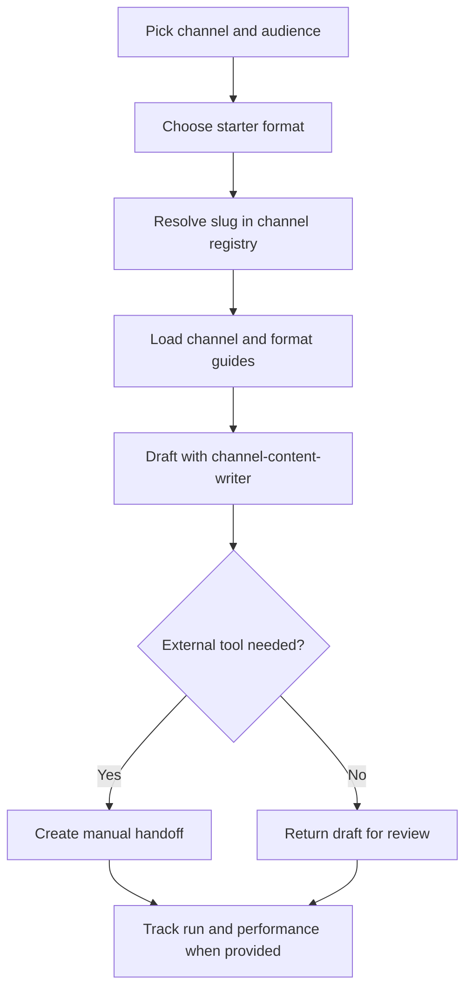

# Channel Starter Formats

Public-safe scaffolding examples for broad marketing channels that do not yet need a dedicated Ink skill.

Use this pack to understand how a program can reference broad channels and route through `channel-content-writer`. It is not the source of truth for reusable channel or format rules. Those rules live in `.agents/channel-content-writer/references/channel-format-index.md`, `.agents/channel-content-writer/references/channel-format-registry.csv`, and the linked `channels/` and `formats/` guides.

## Channels And Routes

Use the channel taxonomy for canonical slugs and the channel/format registry for exact inheritance. Route starter formats through `channel-content-writer` unless a dedicated skill or manual external-tool handoff is a better fit.

## Workflow

## Formats

- `short-video-script`: short-form video script, on-screen text, and shot list.
- `newsletter-issue`: subject lines, preview text, body, and CTA.
- Future `email-sequence` programs should inherit the shared email and cold outreach guides when the campaign is outbound cold email.
- `community-post`: community-native post with moderation/rule notes.
- `youtube-outline`: long-form YouTube outline and thumbnail/title concepts.

## Links

- Channel taxonomy: `.agents/content-program-builder/references/channel-taxonomy.md`
- Channel/format index: `.agents/channel-content-writer/references/channel-format-index.md`
- Channel/format registry: `.agents/channel-content-writer/references/channel-format-registry.csv`
- Generic channel writer: `.agents/channel-content-writer/SKILL.md`
- Program contract: `.agents/content-program-builder/references/program-pack-contract.md`
