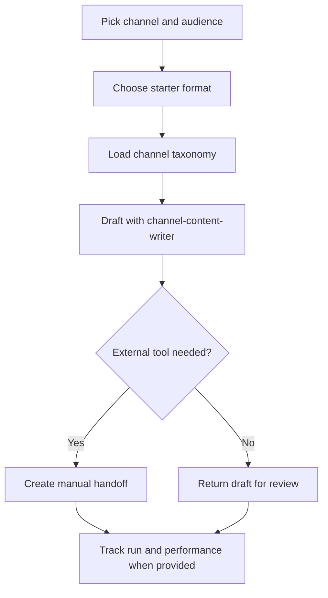

# Channel Starter Formats

Public-safe starter formats for broad marketing channels that do not yet need a dedicated Ink skill.

Use these as references when creating private programs for Instagram Reels, TikTok, YouTube, newsletters, X, Discord, forums, and similar surfaces.

## Channels And Routes

Use the channel taxonomy for canonical slugs such as `instagram-reels`, `tiktok-video`, `youtube-shorts`, `youtube-long`, `newsletter`, `discord`, `forum`, and `x`. Route starter formats through `channel-content-writer` unless a dedicated skill or manual external-tool handoff is a better fit.

## Workflow

## Formats

- `short-video-script`: short-form video script, on-screen text, and shot list.
- `newsletter-issue`: subject lines, preview text, body, and CTA.
- `community-post`: community-native post with moderation/rule notes.
- `youtube-outline`: long-form YouTube outline and thumbnail/title concepts.

## Links

- Channel taxonomy: `.agents/content-program-builder/references/channel-taxonomy.md`
- Generic channel writer: `.agents/channel-content-writer/SKILL.md`
- Program contract: `.agents/content-program-builder/references/program-pack-contract.md`
