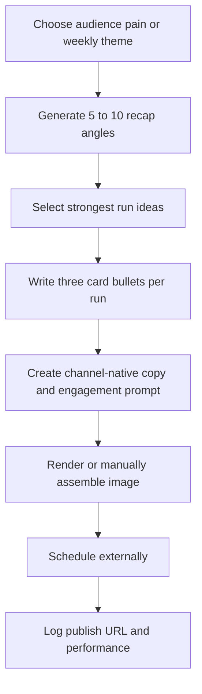

# Daily Recap Card

Recurring format for a branded recap card across visual-first social channels, short-video variants, community posts, or other surfaces where a consistent visual template helps. The card structure stays consistent while the three bullets, caption, and engagement prompt change each run.

This starter is generic. Put real brand assets, private examples, and performance notes in `.local/content-programs/<profile-id>/daily-recap-card/`.

## Goal

- Build repeated brand recall with a recognizable card.
- Turn audience pains into quick, funny, shareable observations.
- Batch several posts at once for later scheduling.

## Format

- One image with a fixed card template.
- Three short bullets on the card.
- One caption, post body, or voiceover hook optimized for the selected channel.
- One first comment, reply prompt, or community discussion hook when channel-native.

## Channels And Routes

Good starter channels include `instagram`, `instagram-reels`, `tiktok-video`, `facebook`, `x`, `threads`, and `linkedin`. Use `manual-asset` for the card render and `channel-content-writer` for channel-native captions, hooks, comments, and short-video variants.

## Workflow

## Good Runs

- The bullets feel like a real frustration the audience would recognize.
- The joke is specific enough to avoid generic work-humor sludge.
- The image has a consistent template, spacing, and brand treatment.
- The channel copy adds context instead of repeating the card.
- The engagement prompt asks a real question, not bait.

## Links

- Program contract: `.agents/content-program-builder/references/program-pack-contract.md`
- Channel taxonomy: `.agents/content-program-builder/references/channel-taxonomy.md`
- Runner skill: `.agents/content-program-runner/SKILL.md`
- Generic channel writer: `.agents/channel-content-writer/SKILL.md`
- Image finder, when external blog-like assets are needed: `.agents/blog-image-finder/SKILL.md`
