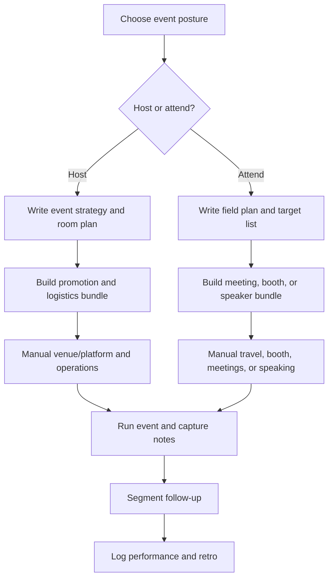

# Event Marketing Operating System

Public-safe starter pack for treating events as a repeatable marketing channel across hosted events, attended events, webinars, hackathons, meetups, roundtables, conference booths, sponsored events, workshops, talks, and follow-up campaigns.

This pack is not the source of truth for reusable event rules. Load the shared event guidance first:

- `.agents/channel-content-writer/references/channels/events-sales.md`
- `.agents/channel-content-writer/references/formats/event-hosting.md`
- `.agents/channel-content-writer/references/formats/event-attendance.md`
- `.agents/channel-content-writer/references/formats/event-promotion-follow-up.md`
- specific format guides such as `hackathon.md`, `meetup-roundtable.md`, `conference-booth.md`, `event-talk-workshop.md`, and `livestream-webinar.md`

## Goal

- Make events repeatable instead of improvised.
- Separate hosted-event operations from attended-event field marketing.
- Fill rooms with the right people, not just more registrants.
- Turn event work into content, community, partner leverage, sales conversations, customer learning, and a better next event.

## Audience

Marketing teams, founders, developer-relations teams, community builders, sales-led teams, and operators who run or attend events as part of a broader go-to-market motion.

## Channels And Routes

Primary event channels include `meetup`, `workshop`, `webinar`, `livestream`, `conference-talk`, `conference-booth`, `hackathon`, `roundtable`, `field-event`, and `sponsored-event`.

Ink can draft strategy briefs, promotion assets, run-of-show docs, speaker kits, booth scripts, follow-up sequences, review packs, and retro templates. Venue booking, catering, beverage purchase, event-platform setup, booth setup, live hosting, facilitation, travel, payment, reimbursement, recording, publishing, and CRM updates remain manual unless a real integration is explicitly used.

## Workflow

## Formats

- `event-strategy-brief`: choose event goal, audience, posture, format, budget, risk, and success metrics.
- `hosted-event-plan`: registration, venue, hospitality, run of show, staffing, sponsor notes, and day-of operations.
- `attended-event-plan`: target list, meeting plan, booth/sponsor/speaker obligations, field notes, and follow-up routing.
- `promotion-and-follow-up-pack`: landing page, invite copy, reminders, partner/speaker kit, recap, and segmented follow-up.
- `webinar-run-of-show`: live/replay promise, engagement plan, platform checklist, Q&A, and replay follow-up.
- `hackathon-program-plan`: rules, venue, builders, mentors, sponsors, judging, submissions, and showcase follow-up.

## Good Runs

- The event promise says who should attend and what they will leave with.
- Host versus attend posture is explicit.
- Manual logistics and content work are separated.
- Budget, venue, hospitality, AV, speaker, sponsor, capture, and follow-up owners are named.
- Registration, attendance, conversation quality, content reuse, and follow-up outcomes are tracked.

## Links

- Program contract: `.agents/content-program-builder/references/program-pack-contract.md`
- Channel taxonomy: `.agents/content-program-builder/references/channel-taxonomy.md`
- Channel/format registry: `.agents/channel-content-writer/references/channel-format-registry.csv`
- Generic channel writer: `.agents/channel-content-writer/SKILL.md`
- Runner skill: `.agents/content-program-runner/SKILL.md`
