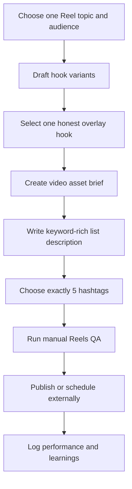

# Hook List Reel

Reusable Instagram Reels starter format for a short eye-catching vertical video with hook text, followed by a long keyword-rich description built as a useful list and exactly 5 relevant hashtags at the bottom.

This starter is generic and public-safe. Keep real brand footage, trend references, account screenshots, private performance notes, and published examples in a selected profile's local Content Program pack.

## Goal

- Turn one specific audience need, pain, tool, category, or recurring question into a saveable and searchable Instagram Reel.
- Use the video and overlay hook to earn attention, then use the description list to deliver depth, keywords, and reasons to save or share.
- Keep reusable Instagram Reels best practices in `.agents/channel-content-writer/references/instagram-reels.md` so other Reels programs can share the same guidance.

## Format

- One original short vertical video or asset brief.
- One short overlay hook that matches the list content.
- One long scannable description that starts strong and then delivers a useful list.
- Exactly 5 relevant hashtags at the bottom of the description.
- One manual publishing and QA checklist for footage, audio, safe zones, thumbnail, and analytics.

## Channels And Routes

Default channel: `instagram-reels`.

Use `channel-content-writer` for the hook, description, hashtag set, and reviewable handoff. Use `manual-asset` for sourcing footage, editing video, verifying audio rights, selecting a cover, previewing safe zones, publishing, scheduling, and comment follow-up outside Ink.

## Workflow

## Good Runs

- The hook is specific, readable, and true to the list.
- The video feels native to Instagram and is original, watermark-free, and visually alive from the first frame.
- The description reads like a useful saved resource, not a keyword dump.
- The hashtags classify the topic precisely instead of chasing broad vanity reach.
- The manual checklist catches anything Ink cannot do directly before the Reel is posted.

## Links

- Instagram Reels guidance: `.agents/channel-content-writer/references/instagram-reels.md`
- Program contract: `.agents/content-program-builder/references/program-pack-contract.md`
- Channel taxonomy: `.agents/content-program-builder/references/channel-taxonomy.md`
- Runner skill: `.agents/content-program-runner/SKILL.md`
- Generic channel writer: `.agents/channel-content-writer/SKILL.md`
