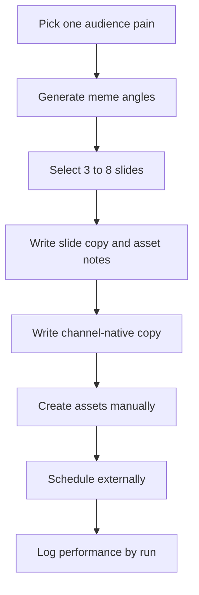

# Meme Carousel

Recurring multi-asset format for several related memes around one audience pain, workflow problem, or product-adjacent theme. It can become a carousel, swipeable post, short-video sequence, community thread, or other channel-native batch.

This starter intentionally avoids bundled meme images. Use only media you have rights to use, generated assets you are allowed to publish, or templates approved by the profile owner.

## Goal

- Package several quick recognitions into one swipeable post.
- Test which pains, roles, and references earn saves, shares, or comments.
- Build a repeatable channel-native format without forcing every post into the same joke.

## Format

- One batch concept.
- Three to eight meme slides, beats, or post units.
- One caption, thread opener, or voiceover frame that fits the channel.
- Optional first comment, reply prompt, or community discussion hook.

## Channels And Routes

Good starter channels include `instagram`, `instagram-reels`, `tiktok-video`, `facebook`, `x`, `threads`, and `linkedin`. Use `channel-content-writer` for concepts and channel-native copy, and `manual-asset` for visual creation, rights checks, and final carousel or video assembly.

## Workflow

## Good Runs

- The slides feel connected, not like unrelated leftovers.
- Each slide has one joke or recognition.
- The channel copy gives the batch a reason to exist.
- Asset rights are clear before publishing.

## Links

- Program contract: `.agents/content-program-builder/references/program-pack-contract.md`
- Channel taxonomy: `.agents/content-program-builder/references/channel-taxonomy.md`
- Runner skill: `.agents/content-program-runner/SKILL.md`
- Generic channel writer: `.agents/channel-content-writer/SKILL.md`
