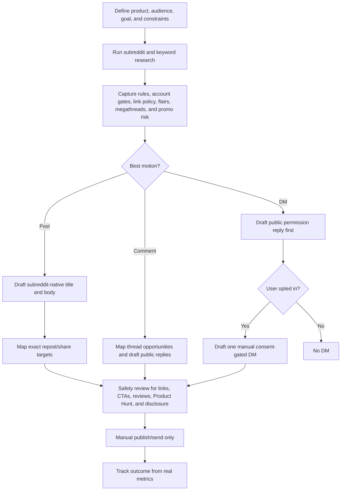

# Reddit Community Growth

Tracked starter program for marketing a product, business, software project, community, or launch through Reddit without turning Reddit into a spam channel.

This pack coordinates three motions:

1. Subreddit-native posts.
2. Public comment engagement in relevant threads.
3. Consent-gated DMs after a user opts in or directly asks for private follow-up.

It is a public-safe starter pack. Do not add private brand examples, real performance data, customer details, scraped user lists, or live campaign targets here.

## Goal

- Find Reddit communities where the selected profile can contribute credibly.
- Draft posts and comments that fit subreddit rules and recent norms.
- Support product, launch, review, download, website, and feedback goals through guardrailed asks.
- Avoid bans, reports, spam flags, vote manipulation, hidden affiliation, and unsolicited outreach.

## Audience

- founders
- indie makers
- product marketers
- developer advocates
- community builders
- software teams
- consumer app teams
- B2B teams with audience-fit Reddit communities

## Channels And Routes

Channel: `reddit`.

Routes:

- `reddit-research`: subreddit discovery, rule snapshots, top-post analysis, keyword/thread opportunity maps, and DM eligibility notes.
- `reddit-social-writer`: subreddit posts, public comment replies, public permission replies, and consent-gated DM drafts.
- `review-only`: safety review before links, review asks, Product Hunt asks, downloads, website CTAs, or DMs.

Do not add a `reddit-dm` channel slug. DMs are a consent-gated Reddit format, not a broadcast channel.

## Format Summary

- `subreddit-intelligence-brief`: ranked subreddits, rules, risks, link policy, keyword map, and recommended motion.
- `subreddit-post-pack`: title/body drafts for approved subreddits, with rule notes, link/CTA decisions, and exact repost/share targets when the same post can be shared unchanged.
- `comment-opportunity-pack`: thread-search prompts, if/then reply playbooks, and ready replies when thread context is supplied.
- `consent-gated-dm-pack`: public permission replies, opt-in criteria, one-message DM drafts, and no-follow-up rules.

## Workflow

## Automation Boundary

Ink can draft research briefs, posts, comments, permission replies, DMs, modmail asks, review notes, and handoff bundles.

Manual work remains:

- checking live subreddit rules before posting
- sending modmail
- posting or commenting on Reddit
- sending any DM after opt-in
- voting, reporting, moderating, and replying
- collecting real performance metrics

Ink must not automate Reddit posting, voting, commenting, scraping, chat requests, DMs, or Product Hunt support asks.

## Exact Repost/Share Rule

When a finished post can fit more than one subreddit without edits, output a simple repost/share target map.

Only include a subreddit when the exact original post title, body, link, media, account posture, disclosure, and account eligibility do not obviously conflict with the target subreddit's rules or posting format. If the target needs a rewrite, a different link, a megathread comment, mod approval, removed self-promotion, a different account, or more account/community karma, exclude it from the simple repost/share list and put it in a "not simple reposts" note.

Simple repost/share is still manual and low-volume. Do not mass-share the same post across communities, and recheck the target rules before using Reddit's repost/share feature.

## Account Eligibility Gates

Subreddits may enforce account age, total karma, local karma, local comment karma, prior participation, or posting-frequency gates through AutoModerator even when the public rules look permissive.

When a gate is known or suspected, capture it in the rule snapshot and exclude that subreddit from post/repost targets until the posting account meets the gate. Warm up through useful comments that fit the community; do not try to bypass the gate with another account or repeated repost attempts.

## References

- Reddit research skill: `.agents/reddit-research/SKILL.md`
- Reddit writer skill: `.agents/reddit-social-writer/SKILL.md`
- Reddit promotion guardrails: `.agents/reddit-social-writer/references/promotion-guardrails.md`
- Reddit format playbooks: `.agents/reddit-social-writer/references/format-playbooks.md`
- Program contract: `.agents/content-program-builder/references/program-pack-contract.md`
- Channel taxonomy: `.agents/content-program-builder/references/channel-taxonomy.md`
